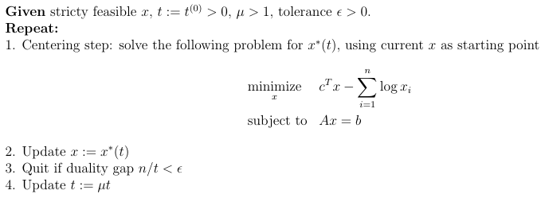

# LP-Solver

This repo implements a simple standard form [Linear Programming (LP)](https://en.wikipedia.org/wiki/Linear_programming) solver in Python. 


The solver uses the barrier method which involves solving an LP centering problem in every iteration (see Chapter 11 of Boyd and Vandenberghe's [Convex Optimization](http://web.stanford.edu/~boyd/cvxbook/) textbook).

## Files
- `lp_solver.py` implements the `LPSolver` class, which can be used as follows:
```Python
# Randomly generate a feasible LP problem
m, n = 100, 500
A = np.random.randn(m, n)
A[0,:] = np.random.rand(n) + 0.1  # make sure problem is bounded
b = np.dot(A, np.random.rand(n) + 0.01)
c = np.random.rand(n)

# Solve the problem
solver = LPSolver(mu=10, tol=1e-4)
solver.solve(A, b, c)
assert solver.status == 'optimal'
print("optimal value: {}".format(solver.value))
```
- `test.py` verifies LPSolver's basic functionalities by running it on both feasible and infeasible LP problems. The results are verified against the output from [CVXPY](https://github.com/cvxgrp/cvxpy).

## Algorithms
### Barrier Method
The feasible start barrier method can be summarized as follows:



The centering problem is an equality constrained optimization problem that can be solved using Newton's method with backtracking line search (see `LPCenteringSolver` in `lp_solver.py`)

### Feasibility Check
Strict feasibility can be first determined by solving the following LP problem, of which a feasible starting point can be easily identified:


The original LP is strictly feasible if and only if the optimal value of this problem is less than 1. The optimal x obtained from this problem can be used as the starting point for the barrier method.

